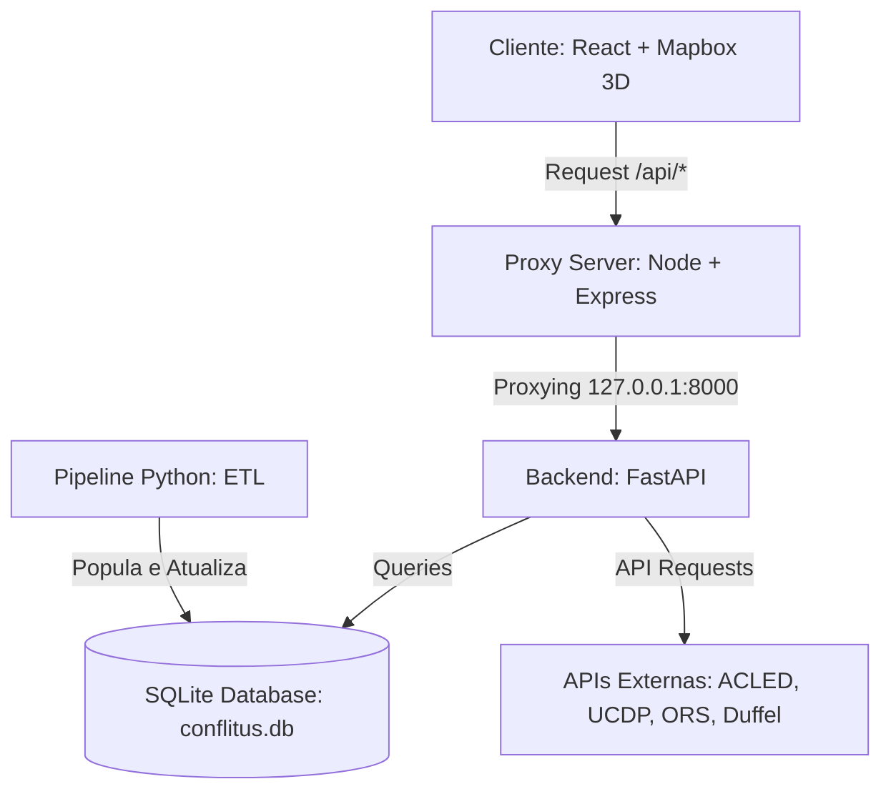

# 🌍 CONFLITUS V2 — Observatório Geopolítico & Aviação Humanitária

O **CONFLITUS V2** é uma plataforma educacional e geopolítica interativa projetada para monitorar conflitos armados ativos ao redor do mundo, detalhar seus contextos socio-históricos e simular rotas de fuga ou evacuação aérea humanitária de emergência. 

Combinando fontes de dados de conflitos em tempo real, mapas interativos em 3D e integrações com APIs de aviação, o sistema visa conscientizar e educar sobre crises globais e logística humanitária.

---

## 🚀 Funcionalidades Principais

### 1. Visualização Cartográfica Interativa (Globo 3D)
* **Globo Mapbox GL:** Representação visual interativa da Terra em 3D.
* **Código de Cores Geopolíticas:**
  * 🔴 **Vermelho (`#ef4444`):** Países com conflitos ativos e críticos monitorados.
  * 🟢 **Verde Suave:** Países de acolhimento parceiros configurados para rotas de acolhimento.
  * 🟣 **Roxo:** Demais países neutros ou não envolvidos diretamente.
* **Interatividade Dinâmica:** Rotação do globo, zoom, efeitos de hover em zonas de risco e cliques em países demarcados para abrir painéis de detalhes.

### 2. Dashboard de Detalhes Geopolíticos
* **Causas Principais & Atores:** Perfis curados detalhando as causas estruturais da guerra e as facções/forças armadas envolvidas.
* **Contexto Histórico:** Textos editoriais que contextualizam a origem e evolução das crises de cada nação.
* **Escalada de Fatalidades:** Gráfico interativo de área (Recharts) que ilustra a evolução mensal das fatalidades ocorridas nos últimos 6 meses.
* **Timeline de Últimos Acontecimentos (ACLED):** Feed cronológico com os 5 incidentes de combate mais recentes do país selecionado, extraídos diretamente do banco de dados ACLED (incluindo tipo, localização exata, data e número de mortes confirmadas).

### 3. Logística de Emergência e Aviação Humanitária
* **Busca de Voos de Urgência (Duffel API):** Mapeamento do país de conflito (ISO3) para a capital e busca automatizada de bilhetes aéreos comerciais de emergência para 5 destinos de acolhimento global:
  * 🇨🇦 **Canadá** (Toronto - YYZ)
  * 🇨🇴 **Colômbia** (Bogotá - BOG)
  * 🇩🇪 **Alemanha** (Frankfurt - FRA)
  * 🇺🇬 **Uganda** (Entebbe - EBB)
  * 🇦🇺 **Austrália** (Sydney - SYD)
* **Espaço Aéreo Fechado:** Detecção inteligente e tratamento de espaço aéreo fechado (como na Ucrânia e no Sudão). Nesses casos, o sistema bloqueia voos comerciais e exibe alertas explicativos de segurança aérea internacional.
* **Traçados de Rota de Fuga:** Ao buscar voos de acolhimento, o mapa renderiza de forma dinâmica linhas tracejadas curvas conectando a zona de conflito aos aeroportos de acolhimento que possuem voos disponíveis.
* **Evacuação Terrestre (OpenRouteService):** Mapeamento de rotas terrestres alternativas para casos em que aeroportos locais estejam inoperantes.

### 4. Análise Estatística & Modelagem Preditiva (Machine Learning)
* **Previsões de Fatalidades:** Uso de regressão linear para estimar o número previsto de fatalidades para o próximo mês para cada zona de conflito.
* **Indicador de Tendência Geral:** Identificação automática da tendência de violência do conflito (Crescente 🔴, Decrescente 🟢, Estável ⚪) com base no coeficiente angular da regressão linear simples.
* **Desempenho Otimizado (Cache SQLite):** Treinamento e processamento estatístico feitos em background no startup e pós-ingestão, salvando os resultados diretamente no SQLite para garantir tempo de resposta de API instantâneo.

---

## 🏗️ Arquitetura do Sistema

A aplicação é dividida em uma arquitetura de microsserviços integrados executados sob um servidor proxy transparente.



### Tecnologias Utilizadas
1. **Frontend (React + Vite):**
   * **React 19 & TypeScript 5** para interface dinâmica fortemente tipada.
   * **Tailwind CSS** para estilização com tema dark/premium (Slate-900 / Zinc).
   * **Mapbox GL** e `react-map-gl` para renderização do globo 3D.
   * **Recharts** para gráficos de escalada e visualização de fatalidades.
   * **Lucide React** para ícones modernos de interface.
2. **Backend (Python + FastAPI):**
   * **FastAPI & Uvicorn** para endpoints assíncronos rápidos e robustos.
   * **Scikit-Learn & NumPy** para o treinamento de modelos de regressão linear de previsão temporal de fatalidades.
   * **Pandas** para processamento analítico eficiente, filtros e agregação dos conjuntos de dados massivos de combate.
   * **Pydantic** para validação e serialização de dados de entrada e saída.
   * **Duffel API Client** para simulação de busca de passagens reais.
   * **SQLite** (banco em arquivo `conflitus.db`) para armazenamento local persistente rápido e sem configuração de infraestrutura complexa.
3. **Servidor Proxy (Node/Express):**
   * **Express** atuando como proxy transparente para o backend em Python, eliminando problemas de CORS no frontend e fornecendo rotas estáticas em produção.
   * **Concurrently** para inicialização em paralelo do frontend e backend com um único comando de console.

---

## 📂 Estrutura de Diretórios

```text
CONFLITUS-V2/
├── backend/                       # Backend em Python/FastAPI
│   ├── app/
│   │   ├── controllers/           # Endpoints/Roteadores (conflitos, rotas, acolhimento)
│   │   ├── database/              # Conexão SQLite e operações CRUD (operacoes.py)
│   │   ├── main.py                # Ponto de entrada FastAPI
│   │   ├── ml.py                  # Lógica de Modelagem Preditiva e Machine Learning (LinearRegression)
│   │   ├── models.py              # Classes Pydantic para tipagem e validação
│   │   └── pipeline.py            # Pipeline ETL de Ingestão de Dados (ACLED/UCDP/Seed)
│   ├── data/                      # Diretório de armazenamento do banco SQLite
│   │   └── conflitus.db           # Banco de dados SQLite criado dinamicamente
│   └── requirements.txt           # Dependências Python (FastAPI, uvicorn, requests, duffel-api)
├── src/                           # Código Fonte do Frontend (React + TypeScript)
│   ├── components/
│   │   ├── Dashboard.tsx          # Painel lateral interativo, gráficos e timeline
│   │   ├── GlobeMap.tsx           # Globo 3D Mapbox GL e camadas cartográficas
│   │   └── RotasDeAcolhimento.tsx # Interface de busca de voos humanitários
│   ├── App.tsx                    # Componente React principal
│   ├── main.tsx                   # Entrada principal do React
│   ├── types.ts                   # Definição de interfaces TypeScript do projeto
│   └── index.css                  # Estilos globais e tokens Tailwind
├── server.ts                      # Servidor Express Proxy (Node/TS)
├── package.json                   # Dependências do Node e scripts npm
├── vite.config.ts                 # Configuração do empacotador Vite
└── .env                           # Configurações locais de tokens e chaves de API (Ignorado no Git)
```

---

## ⚙️ Variáveis de Ambiente (`.env`)

Crie um arquivo `.env` na raiz do projeto contendo as seguintes credenciais obrigatórias para o funcionamento correto das APIs:

```env
# ACLED API (Obtidas registrando-se em acleddata.com)
ACLED_EMAIL=seu_email@dominio.com
ACLED_PASSWORD=sua_senha_ou_chave_acled

# UCDP GED Token (Opcional - Token da API UCDP)
UCDP_TOKEN=seu_token_ucdp

# OpenRouteService Token (Obtido em openrouteservice.org para rotas terrestres)
ORS_TOKEN=seu_token_openrouteservice

# Duffel API Access Token (Obtido em duffel.com para busca de voos)
DUFFEL_ACCESS_TOKEN=duffel_test_seu_token_aqui

# Mapbox Access Token (Obtido em mapbox.com para o globo 3D)
VITE_MAPBOX_TOKEN=pk.eyJ1Ijoic2V1X3Rva2VuX21hcGJveCJ9...
```

---

## 🏃 Como Rodar o Projeto Localmente

### Pré-requisitos
* **Node.js** (versão 18 ou superior)
* **Python** (versão 3.10 ou superior)

### Passo 1: Instalar Dependências do Frontend e Backend
Abra o terminal na raiz do projeto e execute:
```bash
# Instala as dependências Node (Vite, React, Express, Concurrently, etc)
npm install
```

Em seguida, instale as dependências Python para o backend:
```bash
# Instala as dependências Python no ambiente local
pip install -r backend/requirements.txt
```

### Passo 2: Executar o Pipeline de Ingestão de Dados (ETL)
Antes de rodar a aplicação pela primeira vez, você precisa povoar o banco de dados local com as informações curadas dos conflitos e os eventos recentes da ACLED. Execute:
```bash
# Executa a partir da pasta /backend
cd backend
python -m app.pipeline
cd ..
```
*Este comando criará o arquivo `backend/data/conflitus.db`, carregará os conflitos base (seed) e buscará as últimas 5.000 ocorrências de batalhas globais da ACLED, processando e inserindo 13 países ativos em guerra na base local.*

### Passo 3: Iniciar o Servidor de Desenvolvimento
Com o banco populado e as variáveis configuradas, inicie o ecossistema com o comando:
```bash
npm run dev
```
Este comando executará simultaneamente:
1. O servidor frontend e proxy Node na porta `3000`.
2. O backend FastAPI (Uvicorn) na porta `8000`.

Acesse no seu navegador: **[http://localhost:3000](http://localhost:3000)**.

---

## 📦 Compilação para Produção (Build)

Se você deseja gerar a distribuição otimizada para implantação, execute:
```bash
npm run build
```
O comando acima irá:
1. Compilar o frontend React otimizado com o Vite dentro da pasta `dist/`.
2. Compilar o arquivo `server.ts` de proxy e rotas estáticas utilizando o esbuild para `dist/server.cjs`.

Para rodar o pacote final compilado:
```bash
npm start
```
O aplicativo de produção será servido em `http://localhost:3000`.

---

## 🛡️ Políticas de Segurança de Voo e Conflitos

O CONFLITUS V2 implementa regras estritas de simulação realistas:
1. **Espaço Aéreo Hostil:** Países com classificação de risco **Crítico** ou com interdição militar ativa (como Sudão e Ucrânia) têm seus aeroportos bloqueados para a decolagem de voos civis/comerciais de passageiros.
2. **Rotas Alternativas:** Para locais bloqueados, o sistema exibe notificações detalhadas indicando que a evacuação aérea direta está suspensa, incentivando a análise geopolítica dos países fronteiriços ou rotas de evacuação terrestres humanitárias.
3. **Mapeamento IATA:** Conflitos dinâmicos identificados via ACLED são automaticamente resolvidos para suas coordenadas centrais e mapeados para o principal aeroporto da capital nacional correspondente para viabilizar as cotações com a Duffel API.
